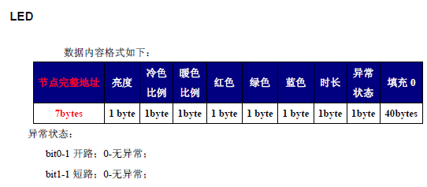

# 灯

::: tip ~
LED 灯套件, API文档 [ledlampequip](https://aliiot.on-bright.com:8090/hardware-suit/classes/ledlampequip.html)
:::

## 协议



## 使用

```js
const ledLampEquip = new LedLampEquip(this.status, this.deviceType, this.deviceChildType)
this.isColorLamp = ledLampEquip.isBicolor()
this.power = ledLampEquip.isPowerOn()
this.bright = ledLampEquip.getBrightness()
this.color = ledLampEquip.getColdColor()
this.exceptionText = ledLampEquip.getLampExceptionStatus() || ''

const status = ledLampEquip.setBrightness(this.bright).setColdColor(this.color).getBytes()
```
