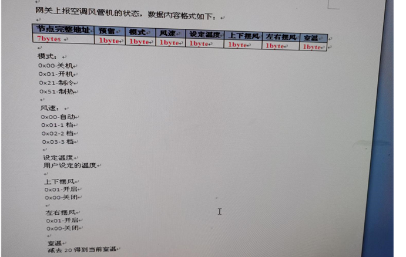

# 线控空调

::: tip ~
 线控空调套件类, API文档 [wireconditionequip](https://aliiot.on-bright.com:8090/hardware-suit/classes/wireconditionequip.html)
:::

## 协议



## 使用

```js
import { WireConditionEquip } from 'hardware-suit'
const equip = new WireConditionEquip(status, deviceType, deviceChildType)
const fanSpeed = equip.getSpeed()
equip.setMode(WireMode.AUTO)
```
